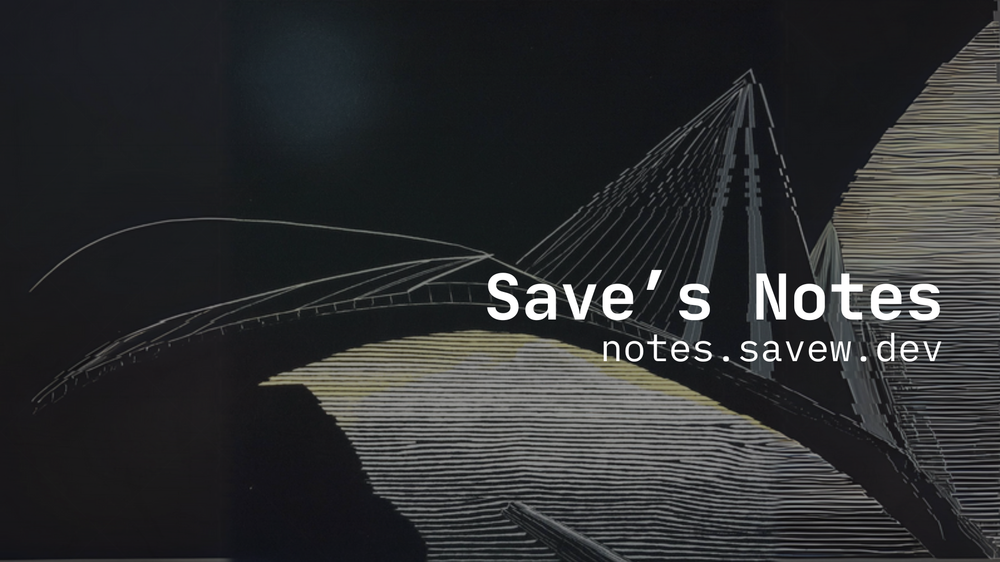

# Markdown Syntax Guide

This note serves as a test bench for the rendering capabilities of our Go-based static site generator. It uses **Goldmark** with GFM extensions and syntax highlighting.

## Typography

You can use *italics*, **bold**, ***bold italics***, and ~~strikethrough~~ text.

> Blockquotes are rendered like this.
>
> They can span multiple lines.

## Lists

### Unordered
* Item 1
* Item 2
  * Nested Item 2.1
  * Nested Item 2.2
* Item 3

### Ordered
1. First step
2. Second step
3. Third step

### Task Lists
- [x] Completed task
- [ ] Pending task
- [ ] Another pending task

## Code Syntax Highlighting

We use `chroma` for syntax highlighting with the Monokai theme.

### Go Example
```go
package main

import "fmt"

func main() {
    fmt.Println("Hello, World!")
    
    // Channels example
    messages := make(chan string)
    go func() { messages <- "ping" }()
    msg := <-messages
    fmt.Println(msg)
}
```

### Rust Example
```rust
fn main() {
    println!("Hello from Rust!");
    
    let numbers = vec![1, 2, 3];
    for n in numbers {
        println!("{}", n);
    }
}
```

### JSON Example
```json
{
  "key": "value",
  "array": [1, 2, 3],
  "nested": {
    "boolean": true
  }
}
```

## Tables

| Feature | Support | Notes |
| :--- | :---: | ---: |
| GFM | Yes | GitHub Flavored Markdown |
| Tables | Yes | Native support |
| Align | Yes | Left, Center, Right |

## Links and Images

[Go to Homepage](/)

Here is a placeholder image:


## Hard Wraps
This line
should be broken
into multiple lines
because hard wraps are enabled.
